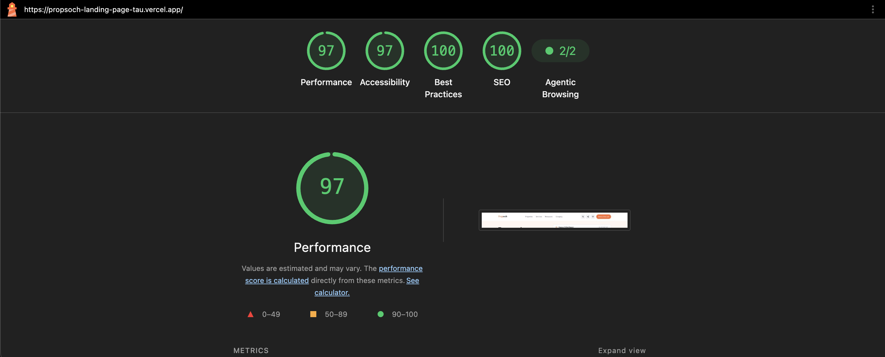
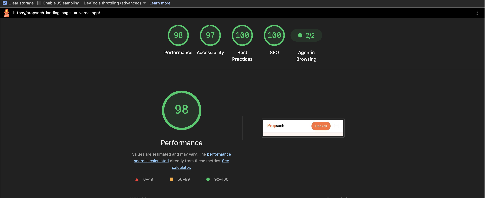

# Propsoch — landing page redesign

A redesign of [propsoch.com](https://www.propsoch.com/): a rebuilt **hero**, plus two
existing sections re-presented — **"How are we different?"** and
**"Here's how you will find a home with us in 25 days"**. Section copy is reproduced verbatim; only the
presentation changed.

**Live:** https://propsoch-landing-page-tau.vercel.app/

**Start here:** [Analysis of the current propsoch.com](https://docs.google.com/document/d/1HVXQi0vZParFoIedGeLsSezEaPzBpsquPuf5iFOvUt0/edit?usp=sharing)
— the UX/UI and performance audit of the live site (Lighthouse desktop + mobile, plus
manual review) that this redesign is a response to. Everything below traces back to a
finding in that document.

```bash
npm install
npm run dev          # http://localhost:3000
npm run build && npm run start
```

Next.js 16 (App Router) · React 19 · TypeScript · Tailwind CSS v4 · no runtime deps
beyond React/Next.

---

## What I improved, and why

### 1. Hero Section — redesigned

**Before:** led with the problem ("Blindly trusting a broker's Sales Pitch? Fake Claims?")
and ended on a generic **Get Started**. A first-time visitor learned what's wrong with
brokers, but not what Propsoch is or what clicking does.

**After:**

- **H1 carries the value proposition** — *"Buy your home on facts, not a broker's sales
  pitch."* The broker critique becomes the contrast, not the whole message.
- **The CTA names the outcome** — "Book my free advisor call", with
  *"15-minute call · No spam, no sales pressure"* beneath it, pre-answering the objection
  their own comparison table raises.
- **One primary, one secondary** ("See how we compare") — never two competing buttons.
- **The CTA leads somewhere.** City choice became a micro-commitment inside the form
  instead of a dropdown blocking the button, and `/start` is server-rendered from the
  chosen city so "what do I get if I click" is answered by the product.
- **The visual makes the argument.** The stock living-room photo was replaced with a
  sample "Peace of Mind Report" — pick a lens (sun, air, massing, surroundings) and the
  analysis draws itself onto the building. Built as a real radio group driven by `:has()`,
  so it works with **zero client JS**.

**Impact:** the page now states the offer, the proof and the next step above the fold.

### 2. "How are we different?" — comparison table

- Propsoch's column lifted onto a white card with a brand rule, so the answer is findable
  before reading.
- ✓ / ✕ **shapes** carry the verdict — never colour alone.
- Both datasets shown, including the *Online portals* comparison the live site hides
  behind a tab.
- Desktop is a real `<table>`; below `md` each criterion becomes a `<dl>` card, because a
  three-column table is unreadable at 320px.
- Tab switching uses **no JavaScript** — hidden radios + `:has()`, with real radio-group
  semantics that work before hydration.

### 3. "Here's how you will find a home with us in 25 days" — journey

- Phases and steps are `<ol>`s, so the sequence lives in the markup, with one continuous
  rail and numbered nodes answering "how many steps are left".
- On desktop the phase labels move to a left column and read as a time axis.
- The Peace of Mind step expands (`<details>`) to show what's actually in the report —
  the obvious question at that point in the journey. Animated in CSS, keyboard
  accessible, no JS.
- Their scroll-linked progress line was dropped: client JS and motion for decoration.

### 4. Responsive (mobile + desktop)

Mobile-first, verified with no horizontal overflow at **320 / 390 / 430 / 768 / 1024 /
1440**. The table→cards and timeline→rail transforms above are structural, not just
reflow. Every target is ≥44px on touch; `prefers-reduced-motion` zeroes delays as well as
durations.

### 5. Optimized images

- Sources pre-resized and re-encoded to **WebP (149 KB and 73 KB)**, with AVIF/WebP
  negotiation on top via `next/image`.
- Static imports → intrinsic dimensions + generated blur placeholder, so **CLS is 0**.
- Hero image preloaded; the journey image is lazy.


## Lighthouse (after) my IM

**Desktop**



**Mobile**



Run against the deployed URL. Against the
[baseline audit](https://docs.google.com/document/d/1HVXQi0vZParFoIedGeLsSezEaPzBpsquPuf5iFOvUt0/edit?usp=sharing)
of the current site:

| Category | Before (desktop / mobile) | After (desktop / mobile) |
| --- | --- | --- |
| Performance | 97 / **64** | 97 / **98** |
| Accessibility | 80 / 84 | **97 / 97** |
| Best Practices | 100 / 100 | 100 / 100 |
| SEO | 83 / 92 | **100 / 100** |
| Agentic Browsing | 1 / 2 | **2 / 2** |

The big one is mobile Performance, 64 → 98 — the original spent 4.0s in JavaScript
execution and 6.4s on the main thread, which Server Components and a no-JS interaction
model remove outright. Accessibility, SEO and Agentic Browsing all failed for the same
root cause (markup leaning on visual context instead of real semantics), so fixing the
semantics once lifted all three.

---

## Structure

```
src/
├── app/                  layout · page · start/ · robots · sitemap · globals.css
├── components/
│   ├── layout/           Navbar · Footer
│   ├── sections/         Hero · DifferenceSection · JourneySection
│   └── ui/               Container · Button · SectionHeading · Wordmark · icons
├── content/              site · hero · difference · journey
└── types/                content contracts
```

Content is separated from presentation — the "don't change the copy" requirement is
verifiable by reading `src/content/difference.ts` and `src/content/journey.ts`.

All colour values come from propsoch.com's own stylesheet (`--primary` `#ff6d33`,
`--foreground` `#0a0a0a`, the coolgrey scale); each token in `globals.css` is annotated
with the Propsoch token it came from. 

---

## Top 5 UI/UX improvements identified

From the [analysis of the current site](https://docs.google.com/document/d/1HVXQi0vZParFoIedGeLsSezEaPzBpsquPuf5iFOvUt0/edit?usp=sharing),
in priority order:

1. **Hero CTA** — "Get Started" blends into the hero and does not say what happens next,
   so I would give it strong visual hierarchy and an outcome-based label like
   "Find My Home".
2. **25-day process** — the journey is buried in long paragraphs, so I would turn it into
   a numbered visual timeline with week markers and progressive disclosure.
3. **SEO basics** — the homepage has no meta description and several images have no alt
   text, so I would add proper Next.js metadata and meaningful alt attributes.
4. **Accessibility and GEO** — icon buttons have no accessible names and the Select City
   control has invalid ARIA, which breaks the accessibility tree for screen readers and
   AI agents alike, so I would fix the semantics at the component level.
5. **Trust logo strip for customers (Company Names)** — the same logos repeat multiple times and push real content below
   the fold, so I would show the strongest five or six once, with optimized, correctly
   sized assets.
